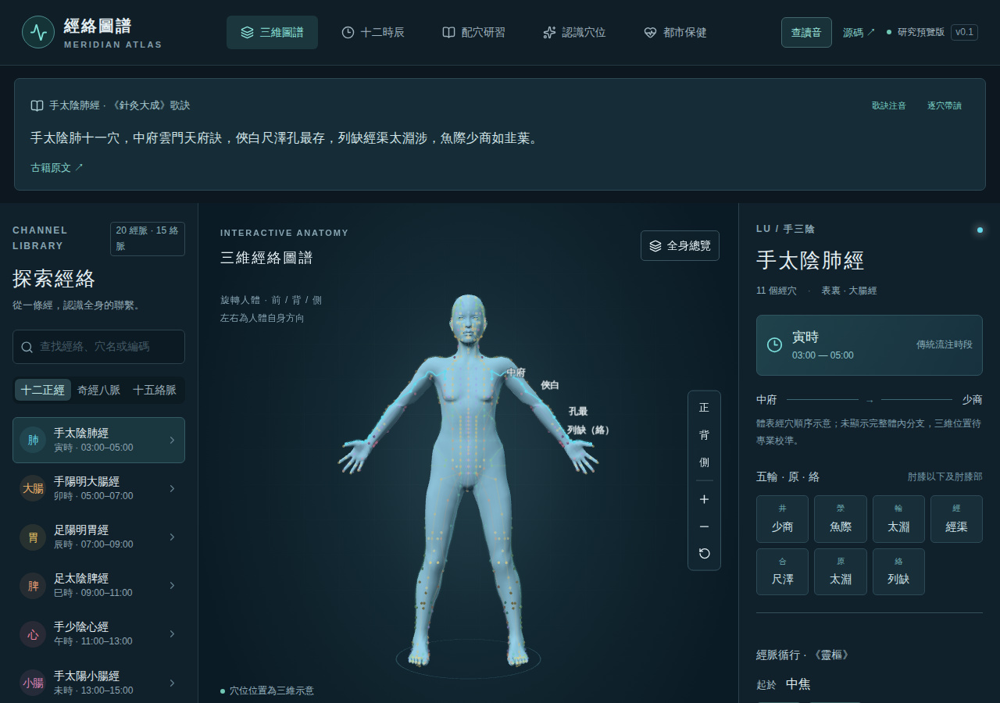
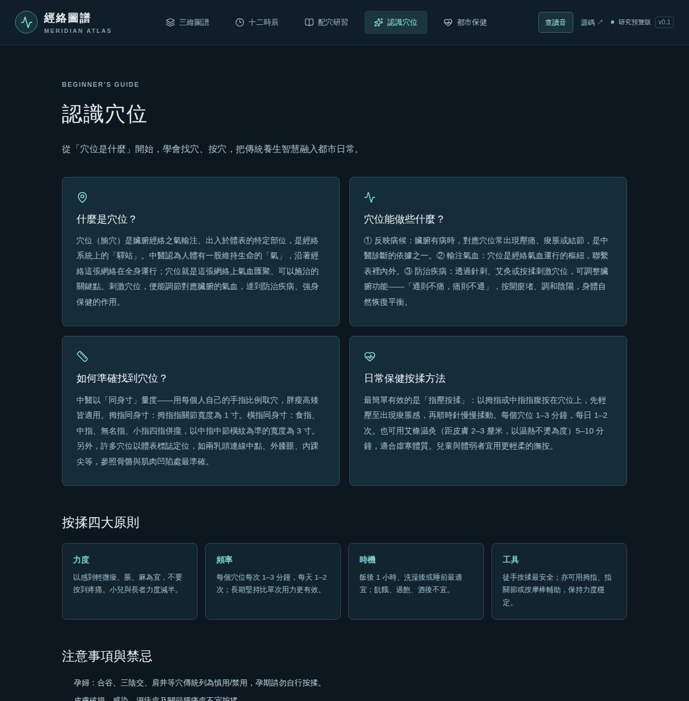
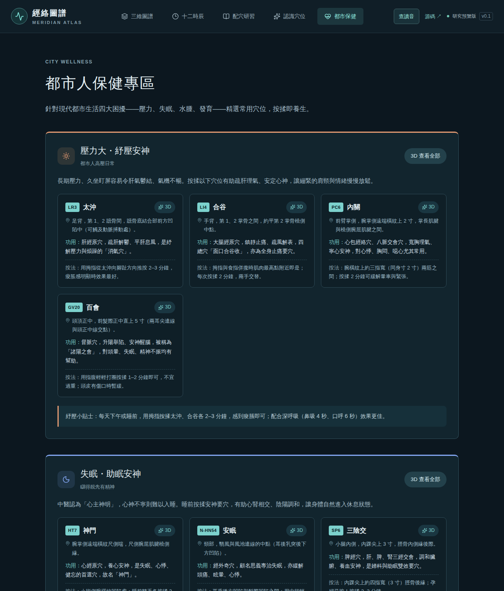
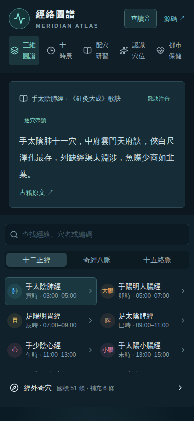
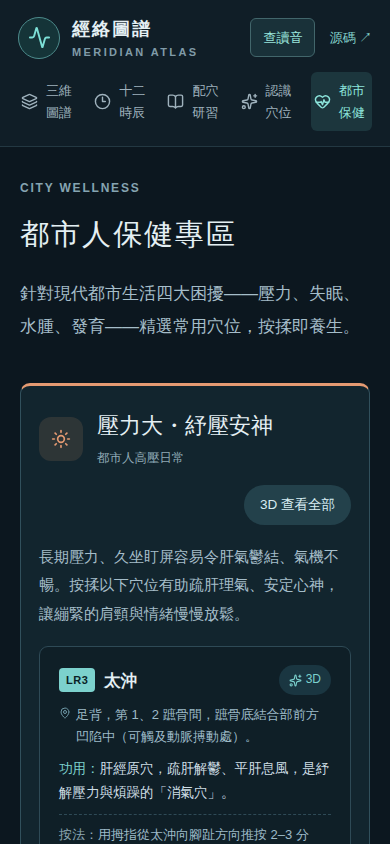

<div align="center">

# Meridian Atlas
### Hong Kong Traditional-Chinese Teaching Edition · 3D Meridian & Acupoint Learning

**Explore meridians in 3D. Connect a point, a verse, a source, and a moment in the traditional daily cycle.**

**12 primary meridians · 8 extraordinary vessels · 15 luo vessels · 419 acupoint learning records**

[](https://acupoint.we1co.me)
[](LICENSE)

[繁體中文](README.md) · [AGPL-3.0](LICENSE) · [Contributing](CONTRIBUTING.md)

**Live: <https://acupoint.we1co.me>**



</div>

---

Meridian Atlas is a Chinese-first, interactive learning application for traditional Chinese meridian theory. Rotate a human model, highlight a channel, inspect acupoints, read classical mnemonics with pinyin, explore traditional two-hour periods, and compare point groups from literature.

> **This repository is a Hong Kong Traditional-Chinese teaching edition of [galaxy-hzy/meridian-atlas](https://github.com/galaxy-hzy/meridian-atlas).** The whole interface and dataset are converted to Hong Kong Traditional Chinese, two teaching pages are added (a beginner's guide and a city-wellness section), and the app is deployed to Cloudflare Workers. See [Changes in this edition](#changes-in-this-edition).

## What you can explore

- **12 primary meridians, 8 extraordinary vessels, and 15 luo vessels.** Separate catalogs, source passages, connecting points, and regional route illustrations.
- **419 learning records:** 362 meridian-point records following GB/T 12346-2021, 51 standardized extra-point records, and 6 supplemental records. Bilateral markers and grouped sites do not inflate this count. Differences from the WHO 361-point system are documented.
- **Interactive 3D anatomy:** drag to rotate, zoom, front/back/side/reset controls, channel highlighting, optional labels and reference guides, and disambiguation menus for overlapping targets.
- **Contextual point details:** an overview before entering the corresponding meridian; location facts, traditional indication summaries, roles and source links once selected.
- **Five Shu, Yuan and Luo roles**, including multiple roles assigned to one point.
- **Search** by Chinese name, channel, identifier and aliases. Point groups can be shared through links such as `/?points=LU7,LI4`.
- **Classical mnemonics above the model**, visual point-by-point recitation, and explicit notes on differences between historical verses and modern point catalogs.
- **Pronunciation lookup:** pinyin for characters, point names and verses; 413 standardized names carry source-indexed readings. Optional browser/system speech assists reading.
- **Mandarin + Cantonese side by side:** every character shows its national-standard pinyin *and* its Cantonese Jyutping, plus a copyable Jyutping string for the whole input.
- **Polyphones list their other readings** instead of silently picking one (`中` zung1/zung3, `差` caa1/caai1/ci1).
- **Acupoint reading corrections:** the dictionary's most common reading is not always the acupoint reading. Readings are pinned by the **GB/T 12346-2021 Mandarin syllable** (膻中 = daan6 zung1, not zin1; 少商 = siu3, not siu2; 大椎 = zeoi1; 膀胱俞 = pong4). The 27 rules live in [`lib/jyutping-overrides.json`](lib/jyutping-overrides.json); tables are built by [`scripts/build-jyutping.py`](scripts/build-jyutping.py) from Unicode Unihan `kCantonese`.
- **Two read-aloud buttons:** `普通話朗讀` and `粵語朗讀` pick the system Mandarin or Cantonese (yue-HK / zh-HK) voice; Jyutping still displays when the device has no Cantonese voice.
- **Daily-cycle learning:** per-channel animation, a 24-hour slider, two-hour period selection, playback and cross-midnight handling.
- **Internal courses and branches:** regional illustrations alongside selected passages from the *Lingshu*, distinct from the surface point sequence.
- **Point-combination studies:** documented traditional combinations, host–guest Yuan–Luo relations and four pairs of extraordinary-vessel confluent points, with links back to the 3D comparison view.
- **Source-aware data:** modern standards, classical texts and contemporary health information are presented separately.
- **Optional WebMCP controls** for the current page. Ordinary UI operation does not require WebMCP support.

No account or external AI API key is required. The runtime dataset and CC0 body model are included. The interface is in Traditional Chinese; this README provides an English introduction.

## New in this edition

**Beginner's guide — `/learn`**



- What an acupoint (腧穴) is, and how it relates to the meridian system and qi-blood flow
- What acupoints do: reflect illness, transport qi and blood, prevent and treat disease
- How to locate points: proportional *cun* measurement and body-landmark methods
- The four principles of massage (pressure, frequency, timing, tools) and cautions

**City wellness — `/care`**



18 commonly used acupoints across four topics, each with **location (per GB/T 12346-2021), traditional function, and massage guidance**, and a one-tap 3D highlight link:

| Topic | Points |
| --- | --- |
| 🧘 Stress relief | LR3 太沖, LI4 合谷, PC6 內關, GV20 百會 |
| 🌙 Insomnia | HT7 神門, N-HN54 安眠, SP6 三陰交, KI1 湧泉, EX-HN3 印堂 |
| 💧 Oedema | CV9 水分, SP9 陰陵泉, ST36 足三里, SP6 三陰交 |
| 🌱 Childhood growth | GV12 身柱, ST36 足三里, BL20 脾俞, BL23 腎俞, KI1 湧泉 |

<div align="center">


</div>

## Mobile and iOS project (inherited from upstream)

This repository keeps the upstream native iPhone project (`mobile/`): the model and learning data are bundled, and the core atlas runs on the user's device. That part is **inherited and not validated in this edition**; this edition focuses on the web app. See [iPhone build guide](docs/IOS.md), [privacy notes](docs/IOS-PRIVACY.md) and [submission notes](docs/IOS-SUBMISSION.md).

## Changes in this edition

| Area | Change |
| --- | --- |
| Traditional Chinese | Whole interface and acupoint dataset converted to **Hong Kong Traditional** (OpenCC `s2hk`); `html lang` and manifest set to `zh-Hant`; external URLs preserved verbatim |
| New pages | `/learn` beginner's guide and `/care` city-wellness section (4 topics, 18 points, deep links via `/?points=`) |
| Cantonese | Pronunciation panel adds **Jyutping side-by-side** with pinyin, polyphone alternatives, a 27-rule acupoint correction table, and a 粵語朗讀 button; tables built from Unicode Unihan `kCantonese` (`lib/jyutping.json`, `lib/jyutping-overrides.json`, `scripts/build-jyutping.py`) and loaded only when the panel opens |
| Navigation | Two new primary-nav entries |
| Metadata | Site title/description reframed for teaching |
| Build | `engines.node` relaxed from `>=24` to `>=22` |
| Deployment | Now **Cloudflare Workers** (worker + static assets), custom domain `acupoint.we1co.me` |

## Run locally

Use Node.js 22+ and a modern WebGL-capable browser.

```bash
git clone https://github.com/forumdata-collab/meridian-atlas.git
cd meridian-atlas
npm install
npm run dev -- --host 127.0.0.1 --port 4318
```

Visit http://localhost:4318/. Routes: `/`, `/clock`, `/combinations`, `/learn`, `/care`, `/sources`.

```bash
npm run typecheck
npm test
npm run lint
npm run build
npm start
```

The last command starts a local production preview with `wrangler dev`. Dependency installation, external reference links and some system voices may require network access. Python is only needed for optional research and data-processing scripts.

The upstream first public version includes 156 automated tests, alongside separately performed browser interaction checks. See [development notes](docs/DEVELOPMENT.md) and [data provenance](docs/DATA.md).

## Deploy (Cloudflare Workers)

```bash
npm run build
export CLOUDFLARE_API_TOKEN=<your API token>
export CLOUDFLARE_ACCOUNT_ID=<your account id>
wrangler deploy --config dist/server/wrangler.json --domain acupoint.we1co.me
```

> If the hostname already has externally managed DNS records, `wrangler` reports `code 100117`. Delete that CNAME first; the `--domain` flag then creates and manages its own DNS for the Worker custom domain.

## Data sources

- Point names, codes and locations: **GB/T 12346-2021** (clause numbers and PDF pages cited)
- Traditional indications: excerpts from scanned classical texts such as the *Zhenjiu Dacheng*, sourced per entry
- Route passages: the *Lingshu · Jingmai* and related classics
- Body model: MakeHuman base mesh (CC0-1.0), points surface-attached

## Scope and limitations

This is an educational visualization, **not a clinically validated point-location system**. Per-point anatomical calibration remains incomplete. Regional curves and body-surface projections are illustrations; traditional circulation animation is not a simulation of blood vessels, blood flow or measurable energy. Traditional indications and literature combinations are not individual treatment recommendations. The application does not provide needling instructions. The content is not medical advice; consult a registered practitioner for any health concern.

The project is in maintenance. Reproducible bug reports, source-supported corrections, accessibility improvements and anatomy reviews tied to the retained model are welcome. Please read [CONTRIBUTING.md](CONTRIBUTING.md).

If this helps you learn or teach, a **Star** helps others discover it. Corrections with a source and a reproducible example are equally valuable.

## License and credits

Original project code and copyrightable original contributions: **GNU AGPL-3.0-only**, copyright galaxy-hzy and contributors. This repository is a derivative work, released under the same AGPL-3.0-only terms. Distribution of derivative versions and network interaction with modified versions carry the applicable corresponding-source obligations. Private use alone does not require public release; commercial use is allowed subject to the license.

Third-party dependencies keep their licenses. The MakeHuman model remains CC0-1.0. Public-domain passages, source facts and third-party materials are not relicensed by this repository. See [LICENSE](LICENSE) and [THIRD_PARTY_NOTICES.md](THIRD_PARTY_NOTICES.md).

Thanks to the original [galaxy-hzy/meridian-atlas](https://github.com/galaxy-hzy/meridian-atlas) project, and to MakeHuman Community, React, Three.js, Vinext, pinyin-pro and related open-source projects. This repository is not endorsed by them.
